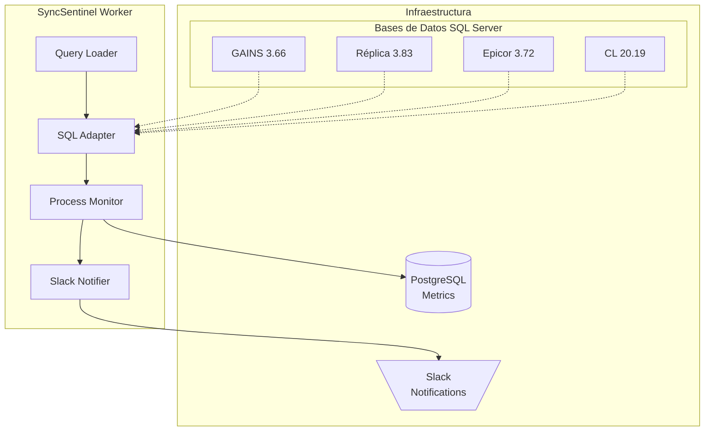
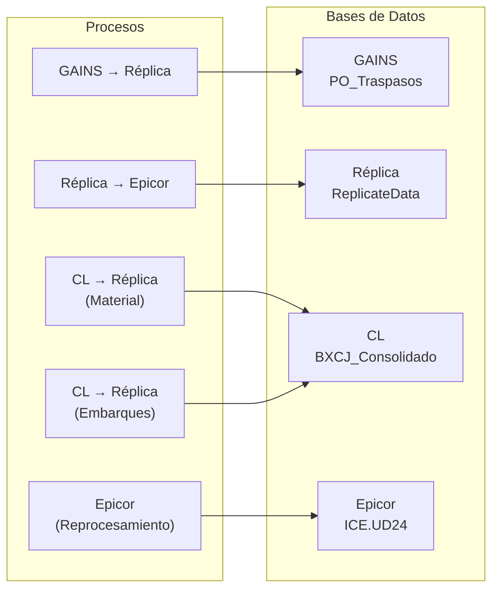

# SyncSentinel

Sistema de monitoreo de sincronización de bases de datos SQL Server para procesos de integración empresarial.

## Arquitectura



## Estructura del Proyecto

```
MonitorCL/
├── config.py              # Configuración con Pydantic Settings
├── Dockerfile            # Imagen Docker
├── docker-compose.yml    # Orquestación
├── requirements.txt      # Dependencias Python
├── .env                  # Variables de entorno
├── .env.example          # Plantilla de configuración
├── queries/              # Archivos SQL individuales
│   ├── gains_aprobaciones.sql
│   ├── replica_aprobaciones.sql
│   ├── cl_material.sql
│   ├── epicor_reprocesamiento.sql
│   ├── cl_embarques.sql
│   ├── replica_epicor.sql
│   ├── replica_cl.sql
│   └── epicor_ship.sql
├── src/
│   ├── domain/          # Entidades y interfaces
│   │   ├── entities.py
│   │   ├── repositories.py
│   │   └── value_objects.py
│   ├── application/     # Casos de uso
│   │   ├── use_cases.py
│   │   └── services.py
│   ├── infrastructure/ # Implementaciones
│   │   ├── adapters.py
│   │   ├── database.py
│   │   ├── notifiers.py
│   │   └── repositories.py
│   ├── entrypoints/     # Punto de entrada
│   │   └── worker.py
│   └── shared/         # Utilidades
│       ├── exceptions.py
│       ├── logging.py
│       ├── query_loader.py
│       └── utils.py
└── tests/
    ├── test_domain.py
    └── test_db_connections.py
```

## Procesos Monitoreados



## Configuración

### Variables de Entorno

| Variable | Descripción | Default |
|----------|-------------|---------|
| `APP_NAME` | Nombre de la aplicación | SyncSentinel |
| `APP_ENV` | Entorno | development |
| `MONITOR_START_TIME` | Inicio de health checks | 18:30 |
| `VALIDATION_START_TIME` | Inicio de validaciones | 19:00 |
| `MONITOR_END_TIME` | Fin de ventana | 05:00 |
| `CHECK_INTERVAL_SECONDS` | Intervalo de ejecución | 180 |
| `MSSQL_USER` | Usuario SQL Server | - |
| `MSSQL_PASS` | Contraseña SQL Server | - |
| `HOST_GAINS` | Host GAINS | - |
| `HOST_REPLICA` | Host Réplica | - |
| `HOST_EPICOR` | Host Epicor | - |
| `HOST_CL` | Host CL | - |
| `MSSQL_DB_GAINS` | Base de datos GAINS | master |
| `MSSQL_DB_REPLICA` | Base de datos Réplica | master |
| `MSSQL_DB_EPICOR` | Base de datos Epicor | master |
| `MSSQL_DB_CL` | Base de datos CL | master |
| `START_DATE_DAYS_BACK` | Días hacia atrás para fecha | 30 |
| `POSTGRES_USER` | Usuario PostgreSQL | postgres |
| `POSTGRES_PASSWORD` | Contraseña PostgreSQL | postgres |
| `POSTGRES_HOST` | Host PostgreSQL | localhost |
| `POSTGRES_PORT` | Puerto PostgreSQL | 5432 |
| `POSTGRES_DB` | Base de datos metrics | db_metrics |
| `SLACK_WEBHOOK_URL` | Webhook de Slack | - |

## Instalación

### Local

```bash
# Crear virtual environment
python -m venv .venv
source .venv/Scripts/activate  # Windows
# o source .venv/bin/activate   # Linux/Mac

# Instalar dependencias
pip install -r requirements.txt

# Copiar configuración
cp .env.example .env
# Editar .env con los valores correspondientes

# Ejecutar tests
pytest tests/ -v
```

### Docker

```bash
docker-compose up -d
```

## Uso

### Ejecutar Worker

```bash
python -m src.entrypoints.worker
```

### Ver Logs

```bash
# Docker
docker logs -f syncsentinel

# Local
tail -f logs/app.log
```

## Queries

Los queries están en archivos individuales en la carpeta `queries/`. 
Cada archivo contiene un query autonomía con placeholders dinámicos:

- `@START_DATE@` - Se reemplaza con la fecha calculada dinámicamente

### Fecha Dinámica

La fecha de inicio se calcula: `today - START_DATE_DAYS_BACK` (default 30 días)

## Tests

### Ejecutar Tests Unitarios

```bash
pytest tests/ -v -k "not integration"
```

### Ejecutar Tests de Integración

```bash
RUN_INTEGRATION_TESTS=1 pytest tests/ -v
```

## Logging

El sistema usa logging estructurado en formato JSON:

```json
{
  "timestamp": "2026-05-07T21:30:00Z",
  "level": "INFO",
  "module": "worker",
  "message": "Iniciando SyncSentinel Worker...",
  "correlation_id": "abc-123-def"
}
```

## Notificaciones Slack

Las notificaciones se envían con formato Block Kit:

```
🟢 Monitor de Sincronización Nocturna
🕒 Última actualización: 2026-05-07 21:30:00

*Proceso:* Aprobaciones GAINS → Réplica | *Estatus:* Pendiente | *Registros:* 15 | *Tiempo:* 00:00:00
*Proceso:* Cola de Material CL → Réplica | *Estatus:* Completado | *Registros:* 0 | *Tiempo:* 02:15:30

📝 Correlation ID: abc-123-def
```

## Contribuir

1. Fork el repositorio
2. Crear una rama feature: `git checkout -b feature/nueva-funcionalidad`
3. Commit los cambios: `git commit -m "Agrega nueva funcionalidad"`
4. Push a la rama: `git push origin feature/nueva-funcionalidad`
5. Crear un Pull Request

## Licencia

MIT License - ver archivo LICENSE