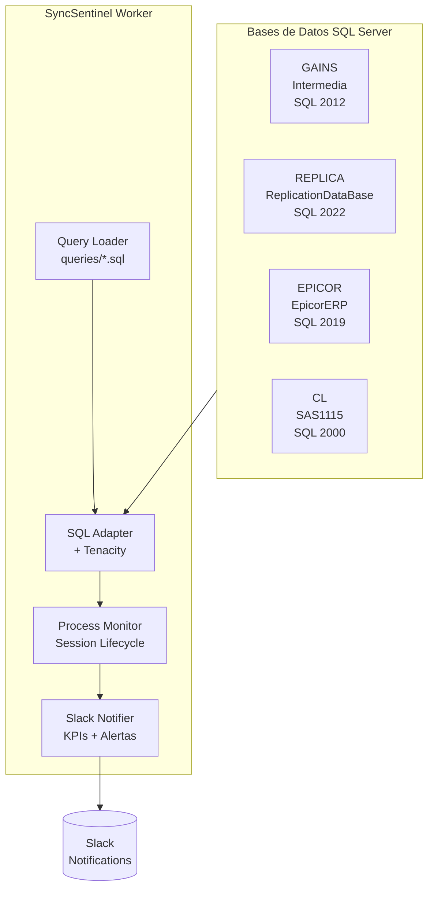
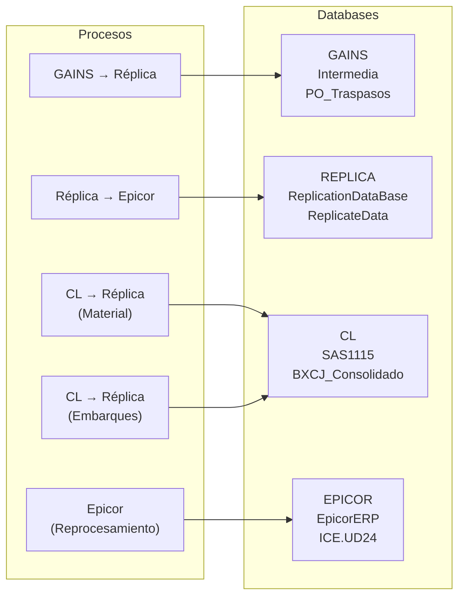
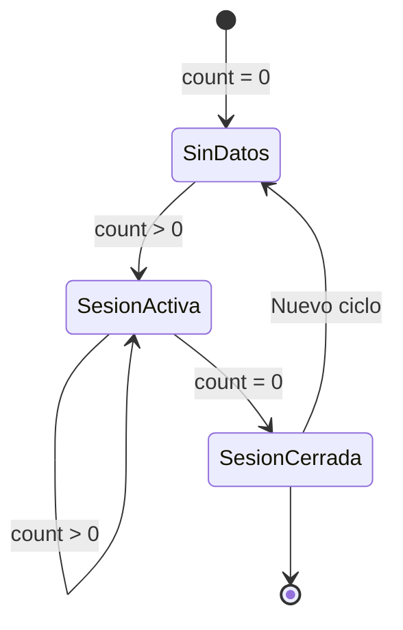

# SyncSentinel

Sistema de monitoreo de sincronización de bases de datos SQL Server con métricas, KPIs y notificaciones en tiempo real.

## Características Principales

| Característica | Descripción |
|-----------------|-------------|
| **Session Lifecycle** | Seguimiento automático de colas con Queue Drain Time |
| **Resiliencia** | Reintentos automáticos con tenacity (3 intentos) |
| **Alertas Críticas** | Notificaciones cuando un proceso falla 3+ veces |
| **KPIs en Slack** | Registros, duración y estado en tiempo real |
| **Scheduler** | Ventana configurable 18:30-06:00, intervalo 10 min |
| **Queries Externos** | SQL en archivos individuales con fechas dinámicas |

## Arquitectura



## Procesos Monitoreados



## Estructura del Proyecto

```
MonitorCL/
├── config.py                 # Configuración Pydantic Settings
├── Dockerfile                # Imagen Docker
├── docker-compose.yml        # Orquestación
├── requirements.txt           # Dependencias Python
├── .env                      # Variables de entorno
├── .env.example              # Plantilla de configuración
├── .gitignore                # Archivos ignorados
├── README.md                 # Documentación
├── prompt.md                 # Especificaciones originales
├── queries/                  # Archivos SQL individuales
│   ├── gains_aprobaciones.sql
│   ├── replica_aprobaciones.sql
│   ├── cl_material.sql
│   ├── epicor_reprocesamiento.sql
│   ├── cl_embarques.sql
│   ├── replica_epicor.sql
│   ├── replica_cl.sql
│   └── epicor_ship.sql
├── src/
│   ├── domain/               # Entidades y Value Objects
│   │   ├── entities.py       # SyncSession, MetricSnapshot, ProcessMetrics
│   │   ├── repositories.py   # Interfaces de repositorios
│   │   └── value_objects.py
│   ├── application/          # Casos de uso
│   │   └── use_cases.py
│   ├── infrastructure/        # Implementaciones
│   │   ├── adapters.py       # SQL Server + Tenacity @retry
│   │   ├── database.py       # PostgreSQL (future)
│   │   ├── notifiers.py     # Slack con KPIs y alertas
│   │   └── repositories.py
│   ├── entrypoints/         # Punto de entrada
│   │   └── worker.py         # Worker principal
│   └── shared/              # Utilidades
│       ├── exceptions.py
│       ├── logging.py       # JSON structured logging
│       ├── query_loader.py # Carga queries desde archivos
│       └── utils.py         # Connectionstrings
└── tests/
    ├── test_domain.py
    └── test_db_connections.py
```

## Bases de Datos

| Servidor | IP | Base de Datos | SQL Version | Driver |
|----------|-----|----------------|--------------|--------|
| GAINS | 10.40.3.66 | Intermedia | SQL Server 2012 | ODBC Driver 17 |
| REPLICA | 10.40.3.83 | ReplicationDataBase | SQL Server 2022 | ODBC Driver 17 |
| EPICOR | 10.40.3.72 | EpicorERP | SQL Server 2019 | ODBC Driver 17 |
| CL | 192.168.20.19 | SAS1115 | SQL Server 2000 | SQL Server |

> **Nota**: SQL Server 2000 requiere driver `{SQL Server}` (no ODBC Driver 17)

## Configuración

### Variables de Entorno

| Variable | Descripción | Default |
|----------|-------------|---------|
| `APP_NAME` | Nombre de la aplicación | SyncSentinel |
| `APP_ENV` | Entorno | development |
| `MONITOR_START_TIME` | Inicio de ventana (hora) | 18:30 |
| `MONITOR_END_TIME` | Fin de ventana (hora) | 06:00 |
| `CHECK_INTERVAL_SECONDS` | Intervalo de ejecución | 600 |
| `START_DATE_DAYS_BACK` | Días hacia atrás para queries | 30 |
| `MSSQL_USER` | Usuario SQL Server | - |
| `MSSQL_PASS` | Contraseña SQL Server | - |
| `HOST_GAINS` | Host GAINS | - |
| `HOST_REPLICA` | Host Réplica | - |
| `HOST_EPICOR` | Host Epicor | - |
| `HOST_CL` | Host CL | - |
| `MSSQL_DB_GAINS` | Base de datos GAINS | master |
| `MSSQL_DB_REPLICA` | Base de datos Réplica | master |
| `MSSQL_DB_EPICOR` | Base de datos Epicor | master |
| `MSSQL_DB_CL` | Base de datos CL | master |
| `SLACK_WEBHOOK_URL` | Webhook de Slack | - |

## Instalación

### Local

```bash
# Crear virtual environment
python -m venv .venv
source .venv/Scripts/activate  # Windows

# Instalar dependencias
pip install -r requirements.txt

# Copiar configuración
cp .env.example .env
# Editar .env con los valores correspondientes

# Ejecutar tests
pytest tests/ -v -k "not integration"
```

### Docker

```bash
docker-compose up -d
```

## Uso

### Ejecutar Worker

```bash
python -m src.entrypoints.worker
```

### Ver Logs

```bash
# Docker
docker logs -f syncsentinel

# Local
tail -f logs/app.log
```

## Session Lifecycle (Queue Drain Time)

El sistema maneja sesiones automáticamente:



1. **count > 0** → Se inicia una nueva sesión con `start_time`
2. **count > 0** → Se guardan snapshots en cada ciclo
3. **count = 0** → Se cierra la sesión y calcula la duración
4. **Duración** = tiempo entre inicio y cuando la cola quedó en 0

### Ejemplo de Logging

```


2026-05-07 23:17:07 - GAINS: SESIÓN INICIADA (count=203)
2026-05-07 23:17:37 - GAINS: count=150, duration=00:00:30
2026-05-07 23:17:07 - GAINS: SESIÓN CERRADA (duration=00:01:15)
```

## Resiliencia

El sistema usa **Tenacity** para reintentos automáticos:

```python
@retry(
    stop=stop_after_attempt(3),
    wait=wait_exponential(multiplier=1, min=4, max=10),
    reraise=True
)
def execute_count_query(self, query: str) -> int:
    ...
```

- **Máx 3 intentos** por consulta
- **Backoff exponencial** (4-10 segundos entre intentos)
- **No afecta** otros procesos si uno falla

## Alertas Críticas

Cuando un proceso falla **3 veces consecutivas**, se envía una alerta a Slack:

```
🚨 ALERTA CRÍTICA - Fallo en Proceso

*Proceso:* GAINS
*Host:* 10.40.3.66

*Error:*
[Microsoft][ODBC Driver 17] Connection timeout

⏱️ 2026-05-07 23:30:00
```

- **Intervalo mínimo**: 30 minutos entre alertas del mismo proceso

## Notificaciones Slack

### Formato de KPI

```
🔄 Monitor de Sincronización
🕒 2026-05-07 23:17
─────────────────────
Aprobaciones GAINS → Réplica
📊 203 | ⏳ En proceso | ⏱️ 00:00:07

Aprobaciones Réplica → Epicor
📊 284 | ⏳ En proceso | ⏱️ 00:00:07

Cola de Material CL → Réplica
📊 0 | 🟢 OK | ⏱️ -

Estatus Epicor
📊 86 | ⏳ En proceso | ⏱️ 00:00:02

Embarques CL → Réplica
📊 0 | 🟢 OK | ⏱️ -
─────────────────────
⏱️ Intervalo: 10 min | Horario: 18:30-06:00
```

### Leyenda

| Símbolo | Significado |
|--------|------------|
| 📊 | Registros/Count |
| ⏳ | En proceso (sesión activa) |
| ✅ | Completado (count = 0) |
| 🟢 | OK (sin sesión, sin errores) |
| ❌ | Error (fallo en query) |
| ⏱️ | Duración (HH:MM:SS) |

## Queries

Los queries están en archivos individuales en `queries/`:

- `@START_DATE@` - Se reemplaza con `today - START_DATE_DAYS_BACK`

### Fecha Dinámica

```bash
# START_DATE_DAYS_BACK=30
# today = 2026-05-07
# @START_DATE@ = 2026-04-07
```

## Tests

### Tests Unitarios

```bash
pytest tests/ -v -k "not integration"
```

### Tests de Integración

```bash
RUN_INTEGRATION_TESTS=1 pytest tests/ -v
```

## Contribuir

1. Fork el repositorio
2. Crear rama: `git checkout -b feature/nueva-funcionalidad`
3. Commit: `git commit -m "Agrega nueva funcionalidad"`
4. Push: `git push origin feature/nueva-funcionalidad`
5. Crear Pull Request

## Licencia

MIT License - ver archivo LICENSE